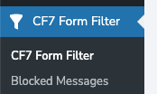
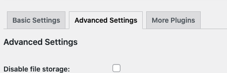
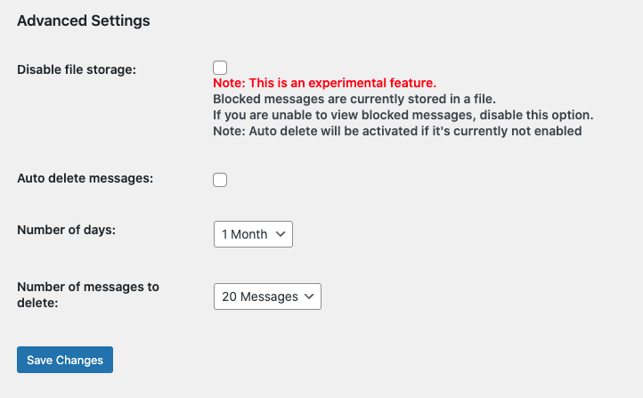

# WordPress Tools

These are a set of helper classes that will make WordPress plugin development easier

Read
this [Article on Medium](https://medium.com/@kofimokome/simplifying-wordpress-plugin-development-using-object-oriented-programming-part-1-bootstrapping-f939f435d31b)
to find out how to use these tools.

## 1. Installation

1. Copy the extracted folder to your plugin directory
2. Copy the .env.example to the root of your plugin and rename the file to .env. Then update the values in the
   .env
3. If you would like to use the `wptools` command line interface:
    1. Copy/move the `wptools` file to the root of your plugin
    2. In your `.env` file, make sure to set the `WORDPRESSTOOLS_DIR` and `NAMESPACE` variables.
    3. cd to the root of your plugin and run `php wptools` for the list of commands.

```bash
$ php wptools
```

4. Import the `WordPressTools.php` file in your plugin main file and instantiate the class.

```php
$wordpress_tools = new WordPressTools( __FILE__ );
```

## 2. How to get the WordPressTools instance

To get the instance of the WordPressTools class, you can use the `get_instance()` method. <br/>
NOTE: An exception is thrown if you have not created an instance of the WordPressTools class.

```php
$wordpress_tools = WordPressTools::get_instance(__FILE__);
```

## 3. Managing Migrations

The WordPressTools provides an easy-to-use interface for managing database migrations. <br/>
Before you can use the migrations, you need to make sure you have done the following:

1. Make sure you have created a folder to store the migrations in your plugin
2. Make sure you have set the `MIGRATIONS_DIR` variable in your `.env` file to this folder.
3. Make sure you have set the `TABLE_PREFIX` variable in your `.env` file to this folder. The table prefix helps to
   avoid conflicts with other plugins.

### 3.1 Creating a migration

To create a migration, you can use the `make:migration` command. <br/>
The command takes one argument which is the name of the migration. <br/>
The name of the migration should be in the format `create_table_name_table` or `add_column_name_to_table`
or `remove_column_name_from_table` <br/>
NOTE: The migration name should be in snake case.

```bash
$ php wptools make:migration create_users_table
```

You can also specify the name of the table using the `--table` option

```bash
$ php wptools make:migration create_users_table --table=users
```

A new migration file will be created the `migrations` folder. <br/>
The file name will be in the format `YYYYMMDDHHMMSS_migration_name.php` <br/>

You can specify the commands to run in the `up` and `down` methods of the migration class. <br/>

```php 
class CreateMessagesTable extends KMMigration {
	protected  $table_name = 'messages';

	public function up( KMBlueprint $blueprint ) {
		$blueprint->id();
		$blueprint->string( 'contact_form' );
		$blueprint->string( 'form_id' );
		$blueprint->text( 'message' );
		$blueprint->timestamps();
	}

	public function down( KMBlueprint $blueprint ) {
		$blueprint->drop();
	}
}
```

### 3.2 Running Migrations

To run migrations, you need to add the code below to your plugin main file.

```php
$wordpress_tools = new WordPressTools( __FILE__ );
$wordpress_tools->migration_manager->runMigrations();

```

### 3.3 Rolling Back Migrations

Rolling back a migration can be done using the `dropMigration` method in the migration_manager. <br/>
The method takes two arguments which are the name of the migration to be rolled back and an optional delete file boolean
flag, which is try by default. <br/>
``` NOTE Deleting a migration can lead to an infinite loop if the delete flag is set to false. We recommend you leave the delete flag as true.```

```php
$migration = $wordpress_tools->migration_manager->getMigration('create_users_table');
$wordpress_tools->migration_manager->dropMigration($migration);
```

You can also use the `dropAll` method to drop all migrations. <br/>

```php
$wordpress_tools->migration_manager->dropAll();
```

### 3.4 Update Migrations

If you want to create a migration to update/alter a table, you must add the `--update` flag when creating the
migration. <br/>

```bash
$ php wptools make:migration add_slug_to_questions_table --table=questions --update
```

An update migration will have the `is_update` property set to true

```php
class AddSlugToQuestionsTable extends KMMigration {
	protected $table_name = 'questions';
	protected $is_update = true;

	public function up( KMBlueprint $blueprint ) {
		$blueprint->string( 'slug', 100 );
	}

	public function down( KMBlueprint $blueprint ) {
		$blueprint->dropColumn( 'slug' );
	}
}
```

## 4. Models

You can use models to query the database, without writing a single SQL command. <br/>
The WordPressTools provides an easy-to-use interface for query the database. Before you can use the model, you need to
make sure you have done the following:

1. Make sure you have created a folder to store the models in your plugin
2. Make sure you have set the `MODELS_DIR` variable in your `.env` file to this folder.

### 4.1 Creating Models

To create a model, you can use the `make:model` command. <br/>
The command takes one argument which is the name of the model. <br/>
The name of the model should be in the format `ModelName` <br/>
NOTE: The model name should be in Pascal case.

```bash
$ php wptools make:model User
```

The model will be created in the `models` directory, a typical model will look like this:

```php
class User extends KMModel {
}
```

By default, the `User` model will automatically point to the users table in your plugin `([your_table_prefix]_users)`.
If you want to link the model
to another table, say the default WordPress users table, add the `--table` flag to the command <br/>

```bash
$ php wptools make:model User --table=wp_users
```

The table property will be automatically set.

```php
class User extends KMModel {
    protected $table_name = 'wp_users';
}
```

#### Other options

The KMModel class provides two other options for customizing your model. <br/>

```php
protected $timestamps = false;
protected $soft_delete = false;
```

1. The `$timestamps` property, if set is true tells the model to automatically update the created_at and updated_at
   columns
   when creating or updating a record. <br/> You can use the ```$blueprint->timestamps();``` statement to add the
   created_at and updated_at columns to your migration.<br/>
2. The `$soft_delete` property, if set is true tells the model to automatically update the deleted_at column when
   deleting
   a record<br/> You can use the ```$blueprint->softDelete();``` statement to add the deleted_at column to your
   migration.<br/>

### 4.2 Adding a New Record

To add a new record, you can create a new instance of the model class and call the `save` method on the instance. <br/>

```php
$message               = new Message();
$message->contact_form = 'cf7';
$message->form_id      = 2;
$message->message      = 'Hello World!';
$message->save();
```

### 4.3 Updating a Record

To update a record, you can use the `save` method on the model. <br/>

```php
$message               = Message::find(1);
$message->contact_form = 'cf7';
$message->form_id      = 2;
$message->message      = 'Hello World Edited!';
$message->save();
```

### 4.4 Deleting a Record

To delete a record, you can use the `delete` method on the model. <br/>

```php
$message = Message::find(1);
$message->delete();
```

If your migration has the soft_delete column, you can use the `softDelete` method

```php
$message = Message::find(1);
$message->softDelete();
```

The `delete` method automatically calls the `softDelete` method if the soft_delete property is set to true. <br/>

### 4.5 Retrieving Records

1. You can retrieve a single record using the `find` method on the model. <br/>

```php
$message = Message::find(1);
```

The find method takes one argument which is the id of the record to be retrieved. It returns the record or null if it
not found<br/>

2. You can retrieve all records using the `all` method on the model. <br/>

```php
$messages = Message::all();
```

The all method takes no argument and returns an array of all the records in the table. <br/>

3. You can also retrieve records using the `where` method on the model. <br/>

```php
$messages = Message::where( 'contact_form', '=', 'cf7' )->get();
```

4. The model class supports method chaining

```php
$messages = Message::where( 'contact_form', '=', 'cf7' )
                        ->where( 'form_id', '=', 2 )
                        ->get();
   ```

5. The `first` method can be used to retrieve the first record that matches the query

```php
$message = Message::where( 'contact_form', '=', 'cf7' )
                        ->where( 'form_id', '=', 2 )
                        ->first();
```

6. The `take` method can be used to limit the number of records to be retrieved

```php
$messages = Message::where( 'contact_form', '=', 'cf7' )
                        ->where( 'form_id', '=', 2 )
                        ->take( 10 );
```

7. The `orderBy` method can be used to order the records

```php
$messages = Message::where( 'contact_form', '=', 'cf7' )
                        ->orderBy( 'created_at', 'desc' )
                        ->get();
```

8. The `groupBy` method can be used to group the records

```php
$messages = Message::groupBy( 'contact_form' )
                        ->get();
```

9. The `orWhere` and `andWhere` methods can be used to add or and where clauses to the query

```php
$messages = Message::where( 'contact_form', '=', 'wp_form' )
                        ->orWhere( 'contact_form', '=', 'cf7' )
                        ->get();
```

10. You can also perform joins using the `innerJoin`, `leftJoin`, and `rightJoin` methods

```php
$applications = JobApplication::orderBy($sort_by, $order);

$applications->leftJoin('jobs')
        ->on('job_id', 'id')
        ->leftJoin('accounts')
        ->on('account_id', 'id');

$results = $applications->get();
```

The table prefix will be automatically added to the table name in the join. For example, `jobs` will
become `[table_prefix]_jobs`.
If you do not want to add the table prefix, you can set the second parameter of the join methods to false.

```php
$applications = JobApplication::orderBy($sort_by, $order);

$applications->leftJoin('jobs', false)
        ->on('job_id', 'id')
        ->leftJoin('accounts', false)
        ->on('account_id', 'id');
        
$results = $applications->get();
```

11. The `get` method can also be used to get particular fields from the result

```php
    $messages = Message::where( 'contact_form', '=', 'cf7' )
                            ->where( 'form_id', '=', 2 )
                            ->get( ['id', 'message']);
```

12. The `paginate` method can be used to paginate the results

```php
    $messages = Message::where( 'contact_form', '=', 'cf7' )
                            ->where( 'form_id', '=', 2 )
                            ->paginate( 10 );
```

The `paginate` method takes two parameters: the first is the number of records to be displayed per page and the second
is the current page number. <br/>

```php
$applications = JobApplication::paginate($per_page, $page)->orderBy($sort_by, $order);

$applications->leftJoin('jobs', false)
        ->on('job_id', 'id')
        ->leftJoin('accounts', false)
        ->on('account_id', 'id');
$select_fields = [
        JobApplication::tableName() . '.*',
        Job::tableName() . '.name AS job_name',
        Job::tableName() . '.slug AS job_slug',
        Account::tableName() . '.name AS account_name ',
];
    
$results = $applications->get( $select_fields);
```

The paginate method returns an array with the following properties:

```php
$data  = [
	'data'       => [], // the results
	'page'       => 1,
	'totalPages' => 10,
	'perPage'    => 2,
	'totalItems' => 100
];
```

## 5. Validating Requests

You can use the `KMValidator` class to validate your API requests.

```php
$validator = KMValidator::make( [
	'title'   => 'required',
	'content' => 'required',
], $_POST );
```

The `KMValidator` class takes two parameters, the first is an array of rules and the second is the data to be validated.
To run the validation, call the `validate` method on the validator object.

```php
$validator->validate();
```

The `validate` method returns a 400 response if the validation fails. It can also return a boolean.
Always check if the validation is successful before using the data.

```php
if ( $validator->validate() ) {
    // use the data
}
```

You can validate the request while instantiation the `KMValidator` class

```php
$validator = KMValidator::validate( [
    'title'   => 'required',
    'content' => 'required',
], $_POST );
```

You can pass more than one rule to a field by separating them with a pipe `|`.

```php
$validator = KMValidator::validate( [
    'title'   => 'required|numeric',
    'content' => 'required',
], $_POST );
```

The following rules are available:

- `required` - The field is required
- `numeric` - The field must be a numeric value
- `integer` - The field must be an integer
- `bool` - The field must be a boolean value (true or false) or (1 or 0)
- `pdf` - The field must be a pdf file

## 6. Menus and Sub Menu Pages

### 6.1. Menu page without sub menu page

a. In a class

```php
$menu_title = 'CF7 Form Filter';

$menu_page = new KMMenuPage(
			array(
				'page_title' => 'CF7 Form Filter',
				'menu_title' => $menu_title,
				'capability' => 'read',
				'menu_slug'  => 'kmcf7-message-filter',
				'icon_url'   => 'dashicons-filter',
				'position'   => null,
				'function'   => array(
					$this,
					'dashboard_view'
				)
			) );

$menu_page->run();
```

b. Not in a class

```php
$menu_title = 'CF7 Form Filter';

$menu_page = new KMMenuPage(
			array(
				'page_title' => 'CF7 Form Filter',
				'menu_title' => $menu_title,
				'capability' => 'read',
				'menu_slug'  => 'kmcf7-message-filter',
				'icon_url'   => 'dashicons-filter',
				'position'   => null,
				'function'   => 'dashboard_view'
			) );
$menu_page->run();
```

### 6.2. Menu page with a sub menu

```php
$menu_title = 'CF7 Form Filter';

$menu_page = new KMMenuPage(
			array(
				'page_title' => 'CF7 Form Filter',
				'menu_title' => $menu_title,
				'capability' => 'read',
				'menu_slug'  => 'kmcf7-message-filter',
				'icon_url'   => 'dashicons-filter',
				'position'   => null,
				'function'   => array(
					$this,
					'dashboard_view'
				)
			) );

$messages_page = new KMSubMenuPage(
			array(
				'parent_slug' => $menu_page->get_menu_slug(),
				'page_title'  => 'Blocked Messages',
				'menu_title'  => 'Blocked Messages',
				'capability'  => 'manage_options',
				'menu_slug'   => 'kmcf7-filtered-messages',
				'position'    => 1
				'function'    => array(
					$this,
					'messages_view'
				)
			) );
$menu_page->add_sub_menu_page( $messages_page );
$menu_page->run();
```

#### output



### 6.3. Sub Menu page with tabs

```php
	$settings_page = new KMSubMenuPage(
			array(
				'parent_slug' => $menu_page->get_menu_slug(),
				'page_title'  => 'Settings',
				'menu_title'  => 'Settings',
				'capability'  => 'manage_options',
				'menu_slug'   => 'kmcf7-message-filter-options',
				'function'    => array(
					$this,
					'settings_view'
				),
				'use_tabs'    => true
			) );
	$settings_page->add_tab( 'basic', 'Basic Settings', array(
			$this,
			'status_tab_view'
		), array( 'tab' => 'basic' ) );
	$settings_page->add_tab( 'advanced', 'Advanced Settings', array(
			$this,
			'status_tab_view'
		), array( 'tab' => 'advanced' ) );
	$settings_page->add_tab( 'plugins', 'More Plugins', array(
			$this,
			'status_tab_view'
		), array( 'tab' => 'plugins' ) );
	$menu_page->add_sub_menu_page( $settings_page );
```

```php
public function status_tab_view( $args ) {
		switch ( $args['tab'] ) {
			case 'plugins':
				include "views/settings/plugins.php";
				break;
			case 'advanced':
				include "views/settings/advanced.php";
				break;
			default:
				include "views/settings/basic.php";
				break;
		}
	}
```

#### output



### 7. Settings API
The `KMSetting` class is a wrapper for the WordPress Settings API. It provides a simple way to create settings page with sections and fields.

```php
$settings = new KMSetting( 'kmcf7-message-filter-options&tab=advanced' );
$settings->add_section( 'kmcfmf_message_filter_advanced' );
$settings->add_field(
			array(
				'type'  => 'checkbox',
				'id'    => 'kmcfmf_message_storage_toggle',
				'label' => 'Disable file storage: ',
				'tip'   => "<span class='text-danger' style='color:red;'>Note: This is an experimental feature.</span><br/>Blocked messages are currently stored in a file. <br/>If you are unable to view blocked messages, disable this option. <br/> <b>Note: </b> Auto delete will be activated if it's currently not enabled"
			)
		);
$settings->add_field(
			array(
				'type'  => 'checkbox',
				'id'    => 'kmcfmf_message_auto_delete_toggle',
				'label' => 'Auto delete messages: ',
				'tip'   => ''
			)
		);
$settings->add_field(
			array(
				'type'  => 'number',
				'id'    => 'kmcfmf_message_auto_delete_duration',
				'label' => 'Number of days: ',
				'tip'   => '',
				'min'   => 1,
				'max'   => ''
			)
		);
$settings->add_field(
			array(
				'type'    => 'select',
				'id'      => 'kmcfmf_message_auto_delete_duration',
				'label'   => 'Number of days: ',
				'options' => array(
					'1 Month' => '30',
					'1 Day'   => '1',
					'3 Days'  => '3',
					'1 Week'  => '7',
					'2 Weeks' => '14',
				),
				// 'default_option' => ''
			)
		);
$settings->add_field(
			array(
				'type'    => 'select',
				'id'      => 'kmcfmf_message_auto_delete_amount',
				'label'   => 'Number of messages to delete: ',
				'options' => array(
					'10 Messages' => '10',
					'20 Messages' => '20',
					'40 Messages' => '40',
					'80 Messages' => '80',
				),
				// 'default_option' => ''
			)
		);
$settings->save();
```

### default field data

```php
$default_data = array(
			'type'           => '',
			'id'             => '',
			'label'          => '',
			'tip'            => '',
			'min'            => '',
			'max'            => '',
			'input_class'    => '', // class for input element
			'class'          => '', // class for parent element
			'options'        => array( 'Select a value' => '' ),
			'default_option' => '',
			'autocomplete'   => 'on',
			'placeholder'    => ''
		);
```

You can display the form using

```php 
$settings->show_form();
```

Alternatively, you don't want to use `show_form()`, you can display the form with your own code

```php
<?php

?>
    <h2>Advanced Settings </h2>
	<?php settings_errors(); ?>
    <form method="post" action="options.php">
		<?php

		settings_fields( 'kmcfmf_message_filter_advanced' );
		do_settings_sections( 'kmcf7-message-filter-options&tab=advanced' );

		submit_button();
		?>
    </form>
<?php
```

### output



## Troubleshooting

### 1. Setting fields not showing on WordPress Dashboard

1. Do not create the setting in the callback function of a menu or submenu, this will not allow the helper to hook into
   the `admin_init` action.

   You can either call the `show_form()` method in the menu page callback function or write the code manually to display
   the form (as shown above) in the callback function
2. If you get `Options page  not found in the allowed options list.` error, set your munu slug as the section
   id [More Info Here](https://wordpress.stackexchange.com/questions/139660/error-options-page-not-found-on-settings-page-submission-for-an-oop-plugin) 